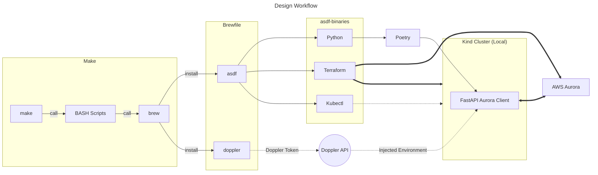

# fuzzy-helium-meme

A simple PostgreSQL client, to connect with AWS Aurora.

## Prerequisites

There are some prerequisites that will allow the developer to interact with this repo much easier, with
greater efficiency.

- [asdf](https://asdf-vm.com/)
- [Terraform](https://developer.hashicorp.com/terraform/tutorials/aws-get-started/install-cli)
- [Python 3.13+](https://www.python.org/)


## TL;DR
For developer experience, a Makefile _(for MacOS only)_ has been provided in the repo root, you can quickly install these with the following command:

```bash
make init
```

### What this does?

This installs _(using Brew)_ `asdf`, and `doppler-cli` _(This is what we will use to obfuscate our Environment Variables, and Secrets)_.

Once asdf is installed, it then get's any required plug-ins, and runs the installation of the plugins within the _"shimmed"_ environment. This does not alter your system binaries or interpreters. You can confirm this by running `$> which python` after the installation is complete!

### Design Workflow Diagram




These are the steps required to build and push the application in this repo to it's required destination.