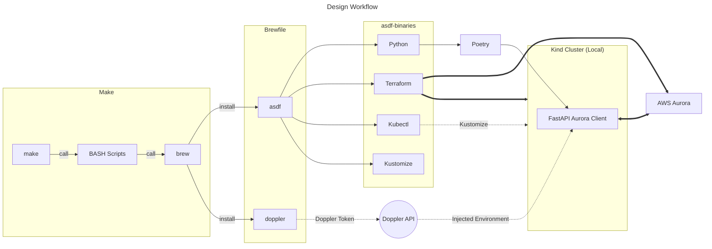

# fuzzy-helium-meme

A simple PostgreSQL client, to connect with AWS Aurora.

## Prerequisites

There are some prerequisites that will allow the developer to interact with this repo much easier, with
greater efficiency.

- [asdf](https://asdf-vm.com/)
- [Terraform](https://developer.hashicorp.com/terraform/tutorials/aws-get-started/install-cli)
- [Python 3.13+](https://www.python.org/)
- [Kubectl 1.34.1](https://kubernetes.io/docs/tasks/tools/install-kubectl-macos/)

## _TL;DR Developer Experience_

For a better developer experience, a Makefile _(for MacOS only)_ has been provided in the repo root, you can quickly install these with the following command:

```bash
make init
```

Once this command is run, please see the [Helium API Client Documentation](./helium/README.md).

#### What does `make init` do?

This installs _(using Brew)_ `asdf`, and `doppler-cli` _(This is what we will use to obfuscate our Environment Variables, and Secrets)_, along with `kubectl`, `kustomize`, and other needed tooling.

Once asdf is installed, it then get's any required plug-ins, and runs the installation of the plugins within the _"shimmed"_ environment. This does not alter your system binaries or interpreters. You can confirm this by running `$> which python` after the installation is complete! You can read more about `asdf` from the link in the [prerequisites](#prerequisites) section.

### Design Workflow Diagram



When running the make commands, this is what is happening under-the-hood.

## Developer Documentation

See the [Developer Documentation](./helium/README.md) for details on building, running, deploying, etc.
