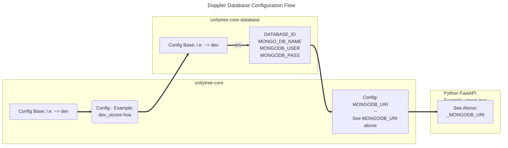

# Database Connectivity

In order to connect to the MongoDB database, there are some key factors in Doppler that restrict the connections of undesired environments, i.e. ~> `prd`.

## Doppler Configs

SERVICE_NAME --> ex: `utcore-hoa`

DOPPLER_PROJECT --> unitytree-core 
DOPPLER_ENVIRONMENT --> `dev`|`stg`|`prd` 
DOPPLER_CONFIG --> `${DOPPLER_ENVIRONMENT}_${SERVICE_NAME}`

### Within the main config for the environment:

DP = Doppler Project 
env = Doppler Environment; i.e. ~> `dev`|`stg`|`prd` 
MONGODB_URI = `mongodb+srv://${unitytree-core-database.<DOPPLER_ENVIRONMENT>.MONGODB_USER}:${unitytree-core-database.<DOPPLER_ENVIRONMENT>.MONGODB_PASS}@${unitytree-core-database.dev.MONGODB_NAME}.${unitytree-core-database.<DOPPLER_ENVIRONMENT>.DATABASE_ID}.mongodb.net/?retryWrites=true&w=majority`

_MONGODB_URI = `f"{MONGODB_URI}&appname={APP_NAME}"`

The Application puts together the needed information for all applications to work from these two Doppler Projects.

Within those Projects, are the environments, and the particular configs for the applications in their respective swimlanes.
